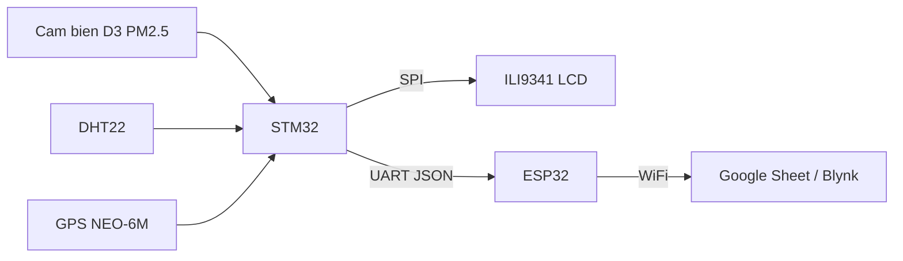

# :seedling: IOT_WireLess - Hệ thống giám sát chất lượng không khí và môi trường

## :movie_camera: Video demo

Bấm vào ảnh để xem video demo:

> :satellite: Thiết bị di động theo dõi PM2.5, nhiệt độ, độ ẩm và GPS, hiển thị trên LCD và đồng bộ lên cloud theo thời gian thực.

## :sparkles: Tổng quan

Dự án xây dựng thiết bị di động theo dõi chất lượng không khí và môi trường xung quanh, đo bụi mịn PM2.5, nhiệt độ, độ ẩm và vị trí GPS. Thiết bị sử dụng STM32 để thu thập và hiển thị dữ liệu trên LCD, đồng thời gửi dữ liệu thời gian thực lên Google Sheet và Blynk thông qua module ESP32. Mục tiêu chính là thu thập dữ liệu có cấu trúc, ổn định và đầy đủ để phục vụ phân tích dữ liệu về sau.

Giá trị thực tiễn:

- :house: Giám sát chất lượng không khí trong nhà/ngoài trời, phòng thí nghiệm, trường học, công trường.
- :round_pushpin: Theo dõi môi trường theo vị trí GPS để đánh giá khu vực có nguy cơ cao.
- :bar_chart: Lưu trữ dữ liệu để phân tích xu hướng và ra quyết định.

## :zap: Tính năng nổi bật

- :bar_chart: Đo đa thông số: PM2.5, nhiệt độ, độ ẩm, vị trí GPS.
- :tv: Hiển thị trực tiếp trên LCD TFT ILI9341.
- :satellite: Gửi dữ liệu thời gian thực qua WiFi (ESP32) lên Google Sheet và Blynk.
- :page_facing_up: Định dạng dữ liệu JSON để đồng bộ và lưu trữ dễ dàng.
- :bulb: Thiết kế chi phí hợp lý, dễ triển khai trong thực tế.

## :telescope: Kiến trúc hệ thống

## :gear: Thành phần phần cứng

- Vi điều khiển: STM32F103RCT6
- Cảm biến bụi: D3 PM2.5
- Cảm biến nhiệt độ/độ ẩm: DHT22
- GPS: NEO-6M
- WiFi: ESP32 (giao tiếp UART với STM32)
- Màn hình: ILI9341 TFT LCD (SPI)
- Nguồn: Adapter 5V

## :computer: Thành phần phần mềm

- STM32: STM32CubeIDE, HAL, LCD ILI9341, DHT22, UART, ADC, GPS parser
- ESP32: ArduinoIDE, xử lý chuỗi dữ liệu nhận từ STM32 và gửi lên server

## :repeat: Luồng dữ liệu

1. STM32 khởi tạo xung nhịp, GPIO, UART, SPI, ADC và các module cảm biến.
2. Đọc dữ liệu từ DHT22, D3 PM2.5, GPS (chuỗi NMEA) và tính toán tọa độ.
3. Hiển thị nhiệt độ, độ ẩm, bụi, GPS và chuỗi JSON lên LCD.
4. Đóng gói dữ liệu JSON và gửi qua UART sang ESP32.
5. ESP32 tách dữ liệu và gửi lên Google Sheet và Blynk.

## :bust_in_silhouette: Đóng góp cá nhân

- Thiết kế và triển khai firmware STM32 (đọc DHT22, D3 PM2.5, GPS; xử lý chuỗi NMEA).
- Đóng gói dữ liệu JSON và truyền UART STM32-ESP32, tối ưu độ ổn định dữ liệu.
- Tích hợp LCD ILI9341, hiển thị thông số thời gian thực và trạng thái gửi dữ liệu.
- Kết nối và kiểm thử việc đẩy dữ liệu lên Google Sheet và Blynk.
- Đánh giá độ trễ, độ ổn định và tổng hợp hạn chế, đề xuất cải tiến.

## :clipboard: Kết quả và đánh giá

- D3 PM2.5: đo được mật độ bụi, độ nhạy chấp nhận được.
- DHT22: hoạt động ổn định, độ lệch khoảng ±1°C so với thực tế.
- GPS NEO-6M: tốt ngoài trời, yếu khi trong nhà.
- LCD ILI9341: hiển thị ổn định, đầy đủ thông tin.
- ESP32: gửi dữ liệu thành công lên server trong 5-7 giây.
- Độ trễ toàn bộ hệ thống: 8-10 giây từ lúc đo đến khi gửi.

## :warning: Hạn chế hiện tại

- LCD chưa hỗ trợ ký tự tiếng Việt.
- Cảm biến bụi chưa hiệu chuẩn nên giá trị dao động.
- GPS yếu khi không có tầm nhìn thoáng lên bầu trời.
- UART cần xử lý lỗi để giảm nhiễu dữ liệu.

## :rocket: Hướng cải tiến đề xuất

- Tối ưu giao tiếp UART (DMA), tăng độ ổn định dữ liệu.
- Cải tiến giao diện hiển thị, bố cục thông tin dễ nhìn hơn.
- Bổ sung vỏ bảo vệ để dùng ngoài trời.
- Hiệu chuẩn cảm biến bụi để tăng độ chính xác.

## :memo: Hướng dẫn nhanh

- STM32: Mở dự án bằng STM32CubeIDE, build và nạp firmware cho STM32F103RCT6.
- ESP32: Nạp code qua ArduinoIDE, cấu hình WiFi và thông tin server (Google Sheet/Blynk).

## :link: Tài liệu tham khảo

- leech001/gps: STM32 HAL library for GPS NEO-6M
- afiskon/stm32-ili9341: HAL-based library for ILI9341 TFT
- Google Sheet (lưu tối đa 300 dòng, dòng cũ bị xóa khi thêm dòng mới)
